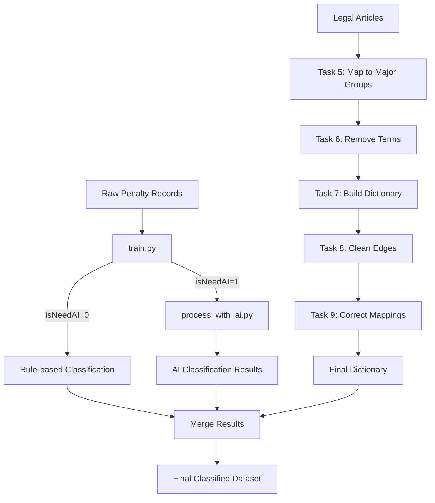

# Illegal Behavior Classification Pipeline

[中文文档](README_CN.md)

This repository contains Python scripts for classifying illegal administrative penalty records using AI models.

## Repository Structure

```
illgal/
├── train/                  # Model training scripts
├── ai_request/             # Third-party AI API integration
├── pipeline/               # Data processing pipeline (Tasks 5-9)
│   ├── 任务5-更细小的分类归大类/
│   ├── 任务6-词条去除/
│   ├── 任务7 字典匹配回关键字/
│   ├── 任务8- 去掉法条左右多余/
│   └── 任务9/
├── .gitignore
└── README.md
```

---

## 1. train/train.py - Predict `isNeedAI`

**Purpose**: Train a binary classification model to predict whether a penalty record needs AI processing (`isNeedAI = 1`) or can be handled by rules (`isNeedAI = 0`).

**Technology Stack**:
- **Model**: SetFit (few-shot learning based on Sentence Transformers)
- **Base Model**: `paraphrase-multilingual-MiniLM-L12-v2`
- **Framework**: Hugging Face `setfit` library

**Input**:
- CSV file with columns: `vc_id`, `text_combined`, `isneedai`

**Output**:
- Trained model saved to `./my_ai_necessity_classifier/`

**How it works**:
1. Reads labeled training data (0 = no AI needed, 1 = AI needed)
2. Uses SetFit contrastive learning to train on text pairs
3. Outputs a classifier that predicts whether new records need AI processing

---

## 2. ai_request/ - Third-party AI Classification

### process_with_ai.py

**Purpose**: Call third-party AI API to classify penalty records and extract structured results.

**Output Format**: 
```
分类 (Category) | 分类原因 (Reason)
```

**Features**:
- Async concurrent API calls with configurable concurrency
- Checkpoint/resume support (skips already processed records)
- Real-time CSV writing to prevent data loss
- Structured response parsing

**Input**:
- CSV with `need_ai=1` records (from train.py prediction)

**Output**:
- CSV with additional columns: `ai_violation_categories`, `ai_reason`, `ai_raw_response`, `process_status`

### config.py

**Purpose**: Configuration file for API settings, file paths, and prompt templates.

**Key Settings**:
- `API_URL`, `API_KEY`, `MODEL_NAME` - API configuration
- `INPUT_FILE`, `OUTPUT_FILE` - Data paths
- `MAX_CONCURRENT` - Concurrency limit
- `PROMPT_TEMPLATE` - Classification prompt

---

## 3. pipeline/ - Data Processing Tasks

### 任务5-更细小的分类归大类 (Task 5 - Map Fine Categories to Major Groups)

**Purpose**: Map granular violation categories to broader category groups.

**Key Files**:
- `config.py` - Category mapping configuration
- `extended_mapping.py` - Extended mapping rules

**Output**: `remapped_cleaned_group_sorted_ai_labeled_big_groups.csv`

---

### 任务6-词条去除 (Task 6 - Remove Unnecessary Terms)

**Purpose**: Filter out irrelevant or meaningless category entries.

**Key Files**:
- `fix_categories.py` - Category cleaning logic

**Output**: `illegal_map_categories.csv`

---

### 任务7 字典匹配回关键字 (Task 7 - Dictionary Matching to Keywords)

**Purpose**: Build a legal article → category dictionary by matching keywords.

**Key Files**:
- `build_legal_article_dict.py` - Main dictionary building script
- `README.md` - Detailed documentation

**Process**:
1. Match legal article text to violation categories using keywords
2. Clean and normalize legal article formats
3. Generate article-category mapping dictionary

**Output**: 
- `step1_keyword_matched.csv` - Initial matches
- `step1_keyword_matched_and_cleaned.csv` - Cleaned results

---

### 任务8- 去掉法条左右多余 (Task 8 - Remove Redundant Text Around Legal Articles)

**Purpose**: Clean legal article text by removing meaningless prefixes and suffixes.

**Key Files**:
- `clean_article_edges.py` - Edge text cleaning logic
- `README.md` - Cleaning rules documentation

**Process**:
1. Identify redundant expressions surrounding core legal articles
2. Apply cleaning rules to extract clean article references
3. Log all modifications for audit

**Output**:
- `task7_cleaned_dict.csv` - Cleaned dictionary
- `task8_changes_log.csv` - Modification log

---

### 任务9 (Task 9 - Category Correction)

**Purpose**: Correct misclassified category mappings based on analysis.

**Key Files**:
- `correct_category_mapping.py` - Main correction script
- `recover_removed_entries.py` - Recover incorrectly removed entries
- `Correction on Mapping from violated law to violation_categories.md` - Correction rules documentation
- `任务说明.md` - Task description

**Process**:
1. Analyze patterns in misclassified entries
2. Apply correction rules
3. Recover valid entries that were incorrectly filtered

**Output**:
- `correction_log.csv` - Correction history
- `去掉法条左右多余信息_final.csv` - Final cleaned data

---

## Data Flow



---

## Origin

This repository is extracted from the `illegal` project, consolidating key AI training and classification scripts for easier management and version control.

**Source Locations**:
- `train.py` ← `new-illgal-train/train.py`
- `ai_request/` ← `new-illgal-train/ai_request/final/`
- `pipeline/` ← `illgal-train-dict/pipeline_scripts/ai/`
