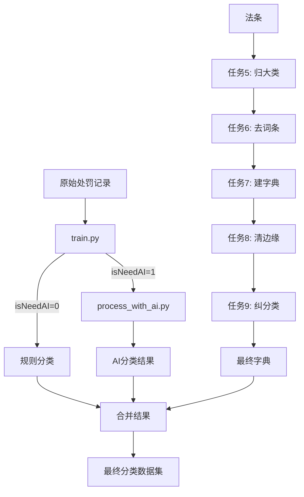

# 违法行为分类流水线

本仓库包含用于分类违法行政处罚记录的AI模型训练和处理脚本。

## 仓库结构

```
illgal/
├── train/                  # 模型训练脚本
├── ai_request/             # 第三方AI API集成
├── pipeline/               # 数据处理流水线（任务5-9）
│   ├── 任务5-更细小的分类归大类/
│   ├── 任务6-词条去除/
│   ├── 任务7 字典匹配回关键字/
│   ├── 任务8- 去掉法条左右多余/
│   └── 任务9/
├── .gitignore
├── README.md               # 英文说明
└── README_CN.md            # 中文说明
```

---

## 1. train/train.py - 预测 `isNeedAI`

**用途**：训练二分类模型，预测处罚记录是否需要AI处理（`isNeedAI = 1`）还是可以通过规则处理（`isNeedAI = 0`）。

**技术栈**：
- **模型**：SetFit（基于 Sentence Transformers 的小样本学习）
- **基础模型**：`paraphrase-multilingual-MiniLM-L12-v2`
- **框架**：Hugging Face `setfit` 库

**输入**：
- CSV 文件，包含列：`vc_id`, `text_combined`, `isneedai`

**输出**：
- 训练好的模型保存到 `./my_ai_necessity_classifier/`

**工作原理**：
1. 读取标注的训练数据（0 = 不需要AI，1 = 需要AI）
2. 使用 SetFit 对比学习在文本对上训练
3. 输出分类器，预测新记录是否需要AI处理

---

## 2. ai_request/ - 第三方AI分类

### process_with_ai.py

**用途**：调用第三方AI API对处罚记录进行分类并提取结构化结果。

**输出格式**：
```
分类 | 分类原因
```

**功能特性**：
- 异步并发API调用，可配置并发数
- 断点续传支持（跳过已处理的记录）
- 实时CSV写入防止数据丢失
- 结构化响应解析

**输入**：
- 包含 `need_ai=1` 记录的CSV（来自 train.py 预测结果）

**输出**：
- CSV 增加列：`ai_violation_categories`, `ai_reason`, `ai_raw_response`, `process_status`

### config.py

**用途**：API设置、文件路径和提示词模板的配置文件。

**主要配置**：
- `API_URL`, `API_KEY`, `MODEL_NAME` - API配置
- `INPUT_FILE`, `OUTPUT_FILE` - 数据路径
- `MAX_CONCURRENT` - 并发限制
- `PROMPT_TEMPLATE` - 分类提示词

---

## 3. pipeline/ - 数据处理任务

### 任务5-更细小的分类归大类

**用途**：将细粒度的违规类别映射到更大的类别组。

**关键文件**：
- `config.py` - 类别映射配置
- `extended_mapping.py` - 扩展映射规则

**输出**：`remapped_cleaned_group_sorted_ai_labeled_big_groups.csv`

---

### 任务6-词条去除

**用途**：过滤无关或无意义的类别条目。

**关键文件**：
- `fix_categories.py` - 类别清理逻辑

**输出**：`illegal_map_categories.csv`

---

### 任务7 字典匹配回关键字

**用途**：通过关键词匹配构建 法条 → 类别 字典。

**关键文件**：
- `build_legal_article_dict.py` - 主字典构建脚本
- `README.md` - 详细文档

**处理流程**：
1. 使用关键词将法条文本匹配到违规类别
2. 清理和规范化法条格式
3. 生成法条-类别映射字典

**输出**：
- `step1_keyword_matched.csv` - 初始匹配
- `step1_keyword_matched_and_cleaned.csv` - 清理后结果

---

### 任务8- 去掉法条左右多余

**用途**：清理法条文本，去除无意义的前缀和后缀。

**关键文件**：
- `clean_article_edges.py` - 边缘文本清理逻辑
- `README.md` - 清理规则文档

**处理流程**：
1. 识别核心法条周围的冗余表达
2. 应用清理规则提取干净的法条引用
3. 记录所有修改以供审计

**输出**：
- `task7_cleaned_dict.csv` - 清理后的字典
- `task8_changes_log.csv` - 修改日志

---

### 任务9 - 分类纠正

**用途**：根据分析纠正错误分类的类别映射。

**关键文件**：
- `correct_category_mapping.py` - 主纠正脚本
- `recover_removed_entries.py` - 恢复被错误删除的条目
- `Correction on Mapping from violated law to violation_categories.md` - 纠正规则文档
- `任务说明.md` - 任务描述

**处理流程**：
1. 分析错误分类条目的模式
2. 应用纠正规则
3. 恢复被错误过滤的有效条目

**输出**：
- `correction_log.csv` - 纠正历史
- `去掉法条左右多余信息_final.csv` - 最终清理数据

---

## 数据流程



---

## 来源

本仓库从 `illegal` 项目中提取，整合了关键的AI训练和分类脚本，便于管理和版本控制。

**原始位置**：
- `train.py` ← `new-illgal-train/train.py`
- `ai_request/` ← `new-illgal-train/ai_request/final/`
- `pipeline/` ← `illgal-train-dict/pipeline_scripts/ai/`
